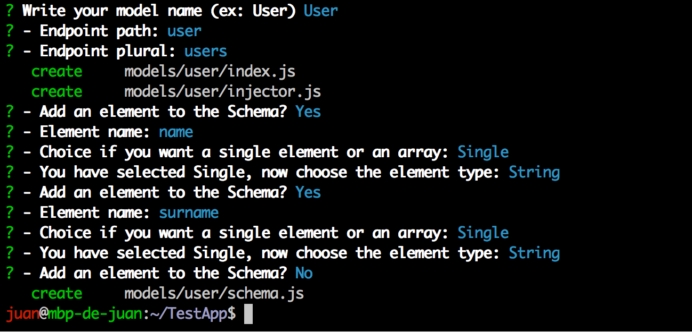
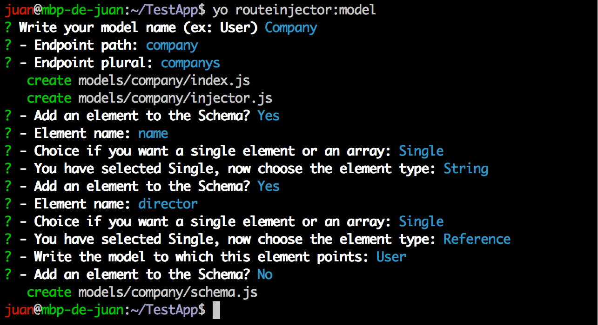
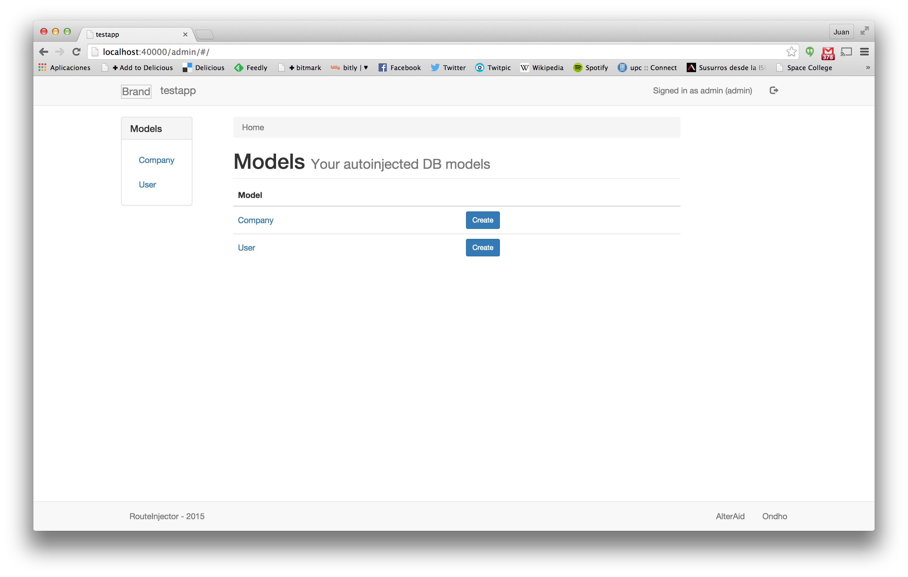

# Step 1. Create your first application

## Prerequisites installation

Please make sure that the following prerequisted are installed.
* NodeJS
* Npm
* Mongodb
* Yeoman
* RouteInjector-Generator

## Create an empty app

Create a new folder and execute the route-injector generator.

```bash
    mkdir TestApp
    cd TestApp
    yo routeinjector
```

Answer the questions about your application. You can choose the template system you want to use, in this case we select ejs.


## Use the generator to create initial models

Let's create a User model with two fields: name and surname; both of them will be of type String.



When we finish adding fields to the model the generator ends, but we can call it again for adding additional models.



This second model, Company, has a string field called name and a reference to the previous User model called director.  After this
initial models creation, we can install the required nodejs modules:

```
    npm install
```

## Models

Let's have a look at the generated User model. All the models are stored in the ./models folder, and a subfolder is 
created for each model. The model configuration is splited in several fields. For the basic models three files: index.js that
loads the additional files, schema.js that defines the schema of the model and injector.js that defines with API routes are 
automagically injected to the model.

#### User schema (./models/user/schema.js):
```js
var schema = new Schema({
    name: {
        type: String
    },
    surname: {
        type: String
    }
}, {
    id: false
});
```
In this file, we can see how the two fields are being coded in a Mongoose model.

#### User injector configuration (./models/user/injector.js):
```js
module.exports = {
    id: "_id",
    path: "user",
    plural: "users",
    displayField: "_id",
    extraDisplayFields: [],
    get: {},
    post: {},
    put: {},
    delete: {},
    search: {}
};
```
The injector configuration specifies which routes are injected and their different options:

| field  | description |
|--------|-------------|
| id     | identifier of the model| 
| path   | URL prefix where the APIs for this model injected. | 
| plural | plural version of the model name. Among other stuff, it is used for generating search API URLs.| 
| displayField | Main field to display (i.e not identifier but human readable). It will be shown in the list view.| 
| extraDisplayFields | Additional fields to show on the list view of the model.| 
| get    | Route for getting information for a model (API will be generated if field is present).| 
| post   | Route for adding a new instance of the model.| 
| put    | Route for modifying an instance of the model.| 
| delete | Route for deleting an instance of the model.| 
| search | Route for search instances of the model (will be named with the plural of the model name).| 

For the Company model, the generated schema is this:

```js
var schema = new Schema({
    name: {
        type: String
    },
    director: {
        type: ObjectId,
        ref: 'User'
    }
}, {
    id: false
});
```

The relation between Company and User is modeled with a field of type ObjectID (it stores the objectID of the director) and a
ref attribute that specifies the Collection where this field points to.

## Start the Application

Make sure that MongoDB is started in other window.
```
    mongod
```

Start the application from the main directory.
```
    npm start
```

Now you can visit the backoffice at http://localhost:40000/admin.



Independent pages are generated for each model. Next you can see how the list view of the User model is rendered:


See that the list view lists the users but only shows the id of the different users, so the result is not very easy to understand. In the next
section we are gonna Useralize the backoffice rendering.

## Basic Personalization

We can modify the display fields, so the list view of the User model will be easier to read: 

#### Updated User injector configuration (./models/user/injector.js):
```js
module.exports = {
    id: "_id",
    path: "user",
    plural: "users",
    displayField: "name",
    extraDisplayFields: ["surname"],
    get: {},
    post: {},
    put: {},
    delete: {},
    search: {}
};
```
For testing the changes, you should restart the NodeJS application because schema information is readed on startup.

Regarding the Company model we can also modify the display fields. Company plural should be 'companies' so the plural setting is
modified.

#### Updated Company injector configuration (./models/company/injector.js):
```js
module.exports = {
    id: "_id",
    path: "company",
    plural: "companies",
    displayField: "name",
    extraDisplayFields: [],
    get: {},
    post: {},
    put: {},
    delete: {},
    search: {}
};
```
## Swagger

The framework also generates by default a [Swagger](http://swagger.io/) API. This documentation helps the developers to use the API generated by the
framework. Remember that this API can be called by the frontend to populate data from the backend. Notice that the search API is called "companies" 
instead of the default of "companys" because we have provided an specific plural in the injector configuration.


