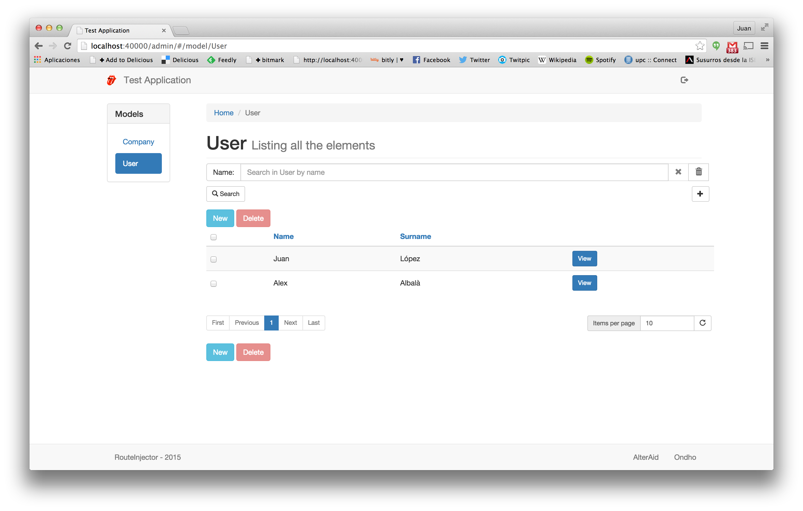

# Step 2. Icon and name configuration

Let's add a static route for serving files. Modify the application.js file for mapping the / route to the /public folder. 

#### Configuracion (./config/application.js).
```js
module.exports = {
    name: 'testapp',
    statics: [
                {
                    url: '/',
                    folder: 'public'
                }
       ]
};
```
The backoffice.js file controls the basic appearance of the generated backoffice. We are gonna add a "long" name for the application
and the logo. This information will be used in the backoffice header.

### Configuracion (./config/backoffice.js). 
```js
module.exports = {
    name: "Test Application",
    logo: "/logo.png"
};
```

Next, we are gonna populate the /public folder.

```
mkdir public
cd public
curl "http://upload.wikimedia.org/wikipedia/tg/9/9d/Tongue_(Rolling_Stones).png" -o logo.png
```

Now, the look&feel of the backoffice will be:

