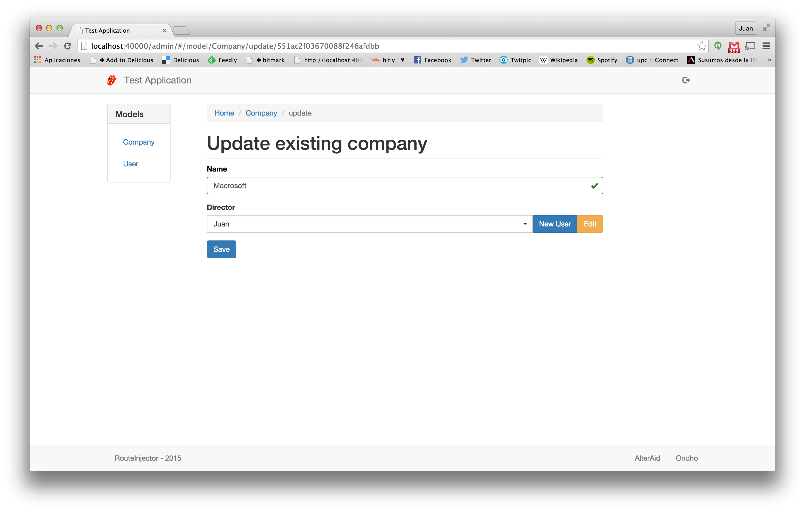
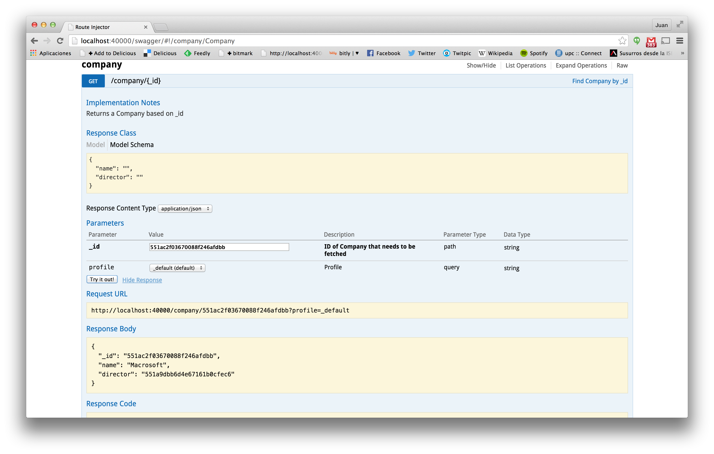
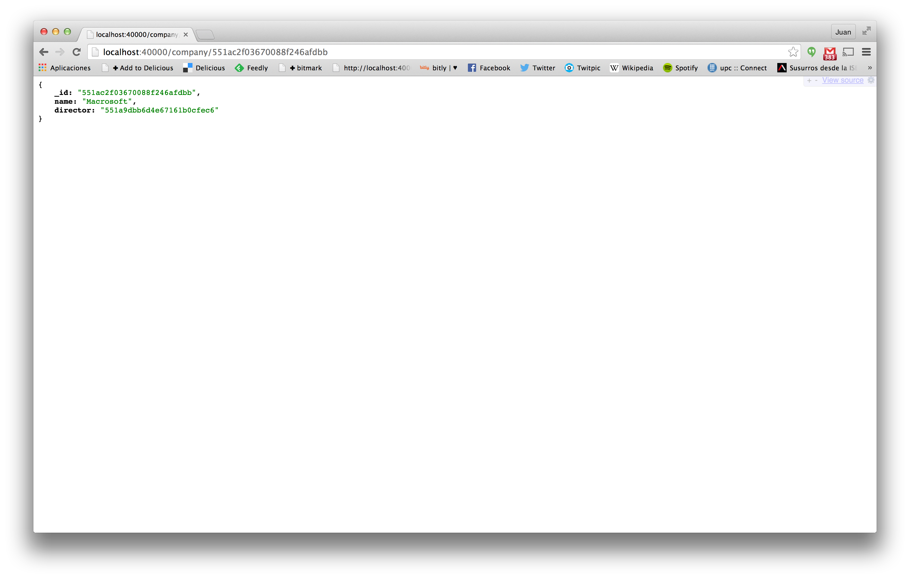

# Step 3. Relationships

Let's analyze the relationships between the Company model and the User model. First, we have added a director field that references
to a user instance. In the MongoDB that field will store the ObjectID of the referenced instance. For example, we add a new company and when 
we edit it again, we see its ObjectID in the URL:



Using this ID we can use the Swagger documentation to get the information for this Company in JSON. Remember that the GET API is the one that
retrieves information for a specific model instance.



This information can also be retrieved by directly calling the URL in the browser.



You can see the id of the Company and also that the director field stores the id of the User model. Its information can be retrieved similarly
browsing the User GET API. 

This way of modeling the information allows not to replicate information in different models so when we update the User name only one specific 
instance has to be modeled. On the other hand, typical usage will require that after retrieving a Company, an additional query to User has to 
be done to retrieve its director information.

## Denormalization

Denormalization allows us to remove this second query, by replicating some of the User data in the Company model. This modeling technique is 
common in NoSQL databases, like MongoDB.

#### Denormalized Company schema (./models/company/schema.js)
```js
var schema = new Schema({
	name: {
		type: String
	},
	director: {
		type: ObjectId,
		ref: 'User'
	},
	ceo: {
		type: Schema.Types.Mixed,
		ref: 'User',
		denormalize: ['name','surname']
	}
}, {
	id: false
});
```

The ceo field is configured to be a Mixed (i.e an unspecified object) that references the User model. The denormalize attribute specifies the 
User fields that must be replicated here.

After restarting NodeJS, we can update the Company to choose its ceo. At the backoffice level, director and ceo fields will be equally rendered,
but if we get again the information from the GET API, we will see that the information is stored in a different way.

```js
{
  "_id": "551ac2f03670088f246afdbb",
  "name": "Macrosoft",
  "director": "551a9dbb6d4e67161b0cfec6",
  "ceo": {
  	"name": "Alex",
	"surname": "Albalà"
  }
}
```
The ceo field is stored inside MongoDB as an embedded Object that has the name and surname fields denormalized from the User schema. This technique
improves the frontend usage, because with only one AJAX request we get all the information we need.

 

